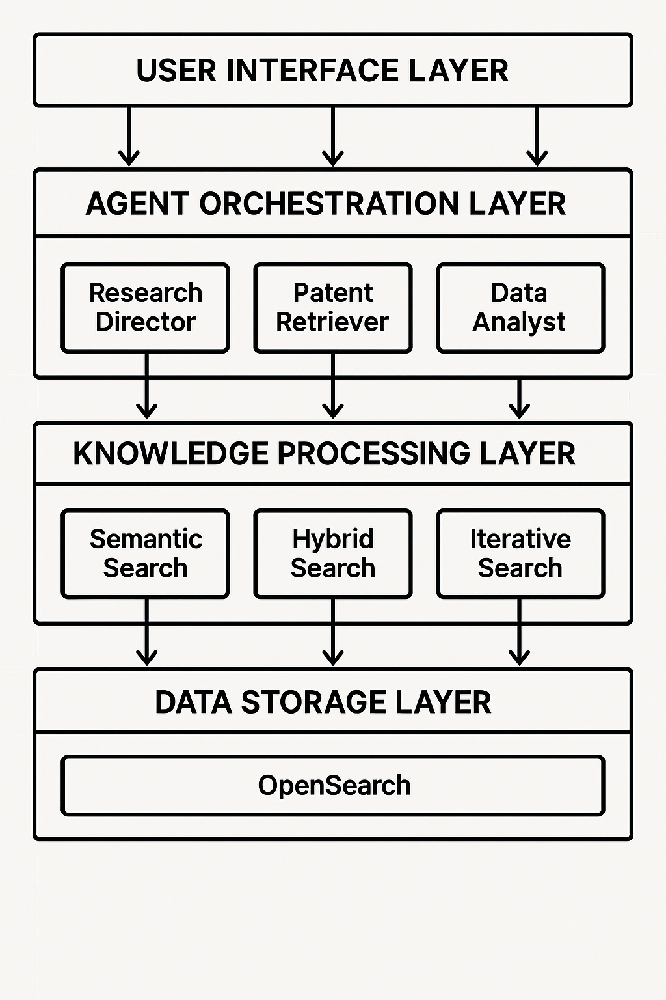

# AI Product Research Agent 🔍 🤖

[](https://www.python.org/downloads/)
[](https://github.com/joaomdmoura/crewAI)
[](https://opensearch.org/)

A collaborative AI agent system that revolutionizes patent research and innovation forecasting using CrewAI, Ollama, and OpenSearch technologies.
This project leverages a multi-agent architecture to analyze patent data, focusing on lithium battery technology, and predict future innovations. It integrates various AI models and tools to provide insights into technological advancements.

## 🎯 Overview

This system analyzes patent data to identify trends and predict future innovations in specific technology areas (with a focus on lithium battery technology). It uses a multi-agent approach with specialized roles for research direction, patent retrieval, data analysis, and innovation forecasting.

### Key Features

- 🤖 Multi-agent architecture for specialized analysis tasks
- 🔄 Iterative and semantic patent search capabilities
- 📊 Advanced data analysis and trend identification
- 🔮 AI-powered innovation forecasting
- 💾 Efficient data storage and retrieval with OpenSearch
- 🚀 Local LLM integration via Ollama

## 🏗 System Architecture



The system is built with a layered architecture consisting of:
- **User Interface Layer**: Handles user interactions and input processing
- **Agent Orchestration Layer**: Manages specialized AI agents (Research Director, Patent Retriever, Data Analyst, Innovation Forecaster)
- **Knowledge Processing Layer**: Implements various search strategies (Semantic, Hybrid, Iterative)
- **Data Storage Layer**: Uses OpenSearch for efficient data management and retrieval


## Prerequisites

- Python 3.10+
- [Ollama](https://ollama.com/) for running local LLM models
- OpenSearch instance running (default: `localhost:9200`)
- Access to patent data (pre-loaded in OpenSearch)

## 🚀 Quick Start

1. **Clone the repository:**
   ```bash
   git clone https://github.com/Mukku27/ai-product-research-agent.git
   cd ai-product-research-agent
   ```

2. **Create a virtual environment:**
   ```bash
   python -m venv .venv
   source .venv/bin/activate  # On Windows, use `.venv\Scripts\activate`
   ```

3. **Install the package:**
   ```bash
   
   pip install .


   
   ```

4. **Install and start Ollama as a Docker Container:**
   ```bash
   docker run -d -v ollama:/root/.ollama -p 11434:11434 --name ollama ollama/ollama
   ```

5. **Pull required models:**
   ```bash
   # Language Model for analysis and reasoning
   docker exec -it ollama ollama run deepseek-r1:1.5b
   
   # Embedding Model for semantic search
   docker exec -it ollama ollama run nomic-embed-text
   ```

6. **Start OpenSearch:**  
   ```bash
   docker compose up -d
   ```
   Make sure your OpenSearch instance is running on `localhost:9200` (or update the connection settings in the code).

## 🔧 Development Setup

### System Requirements

- Docker and Docker Compose
- 8GB+ RAM recommended for running models
- Disk space: ~5GB for models and Docker images
- NVIDIA GPU (optional, but recommended for better performance)

### Code Style and Quality

This project follows:
- PEP 8 style guide for Python code
- Type hints for better code clarity
- Docstring documentation for all modules and functions

## Configuration

1. **Environment variables (optional):**  
   Create a `.env` file for any API keys or configuration:
   ```
   # Optional API keys
   SERPAPI_API_KEY=your_key_here
   ```

2. **OpenSearch setup:**  
   The system will automatically create necessary indices if they don't exist.

## 📚 Usage

### Basic Usage

Run the main application:
```bash
python main.py
```

### Advanced Configuration

The system can be customized through various configuration options:

1. **Agent Configuration:**
   - Modify agent behaviors in `agent_orchestrator.py`
   - Adjust search parameters in `search_tools.py`

2. **Model Selection:**
   - Change LLM models in the configuration
   - Customize embedding models for different use cases

3. **Search Parameters:**
   - Adjust search scope and depth
   - Modify relevance thresholds

## 🤝 Contributing

Contributions are welcome! Please feel free to submit a Pull Request. For major changes, please open an issue first to discuss what you would like to change.

1. Fork the repository
2. Create your feature branch (`git checkout -b feature/AmazingFeature`)
3. Commit your changes (`git commit -m 'Add some AmazingFeature'`)
4. Push to the branch (`git push origin feature/AmazingFeature`)
5. Open a Pull Request

## 📄 License

This project is licensed under the MIT License - see the [LICENSE](LICENSE) file for details.

## 🙏 Acknowledgments

- [CrewAI](https://github.com/joaomdmoura/crewAI) - Multi-agent framework
- [Ollama](https://ollama.com/) - Local LLM capabilities
  - [DeepSeek-R1 1.5B](https://ollama.com/library/deepseek-r1:1.5b) - Core reasoning and analysis model
  - [Nomic Embed Text](https://ollama.com/library/nomic-embed-text:latest) - Text embedding model for semantic search
- [OpenSearch](https://opensearch.org/) - Search functionality

